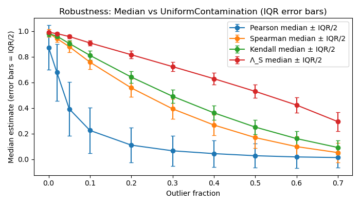
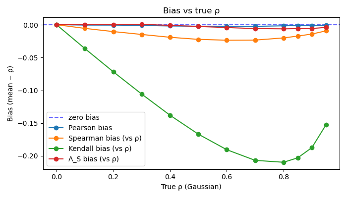
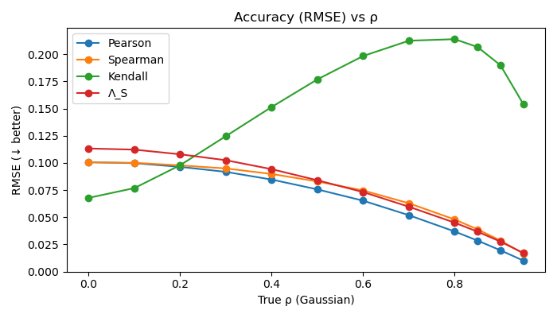
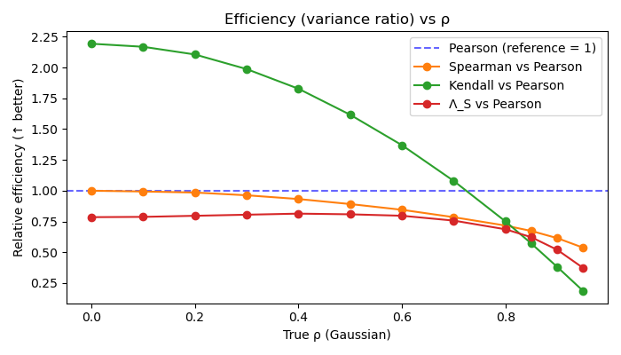

# lambda_corr — Repeated-Average-Rank Correlation Λ (Lambda)

`lambda_corr` introduces and implements the **Repeated-Average-Rank Correlation Λ (Lambda)**, 
a new family of robust, symmetric, and asymmetric measures of monotone association 
based on **pairwise rank slopes**. Compared with traditional rank-based measures 
(Spearman’s ρ and Kendall’s τ [1,2]), Lambda is:

- **Substantially more resistant to noise and outliers** (see [/results/\*Robustness\*.png](results/)).
<div align="center">

<table>
<tr>
<td align="center" style="vertical-align: middle;">

**Robustness of **$\mathbf{\Lambda_s}$**:  
Uniform distribution contamination of both variables  
                        (with limits 10*std(z))**  
$\rho_{true}$ = 1, n = 100  
Comparison vs Pearson's r, Spearman’s ρ and Kendall’s τ.

</td>
<td>

<p align="center">
  
</p>

</td>
</tr>
</table>

</div>


- **Much less biased relative to Pearson’s r [3] linear correlation** (see [/results/\*bias\*.png](results/)).
<div align="center">

<table>
<tr>
<td align="center" style="vertical-align: middle;">

**Bias of **$\mathbf{\Lambda_s}$** vs $\rho_{true}$**:  
n = 100  
Comparison vs Pearson's r, Spearman’s ρ and Kendall’s τ.

</td>
<td>

<p align="center">
  
</p>

</td>
</tr>
</table>

</div>

- **Competitive or superior in accuracy**, especially for moderate–strong signals (see [/results/\*accuracy\*.png](results/)).
<div align="center">

<table>
<tr>
<td align="center" style="vertical-align: middle;">

**Accuracy of **$\mathbf{\Lambda_s}$** vs $\rho_{true}$**:  
n = 100  
Comparison vs Pearson's r, Spearman’s ρ and Kendall’s τ.

</td>
<td>

<p align="center">
  
</p>

</td>
</tr>
</table>

</div>

- **Competitive in efficiency**, for moderate–strong signals. Slightly less efficient asymptotically (~81% vs. ~91% for ρ and τ) for the null. 
  See [/results/\*efficiency\*.png](results/) and [/results/\*power\*.png](results/)
<div align="center">

<table>
<tr>
<td align="center" style="vertical-align: middle;">

**Efficiency of **$\mathbf{\Lambda_s}$** vs $\rho_{true}$**:  
n = 100  
Comparison vs Pearson's r, Spearman’s ρ and Kendall’s τ.

</td>
<td>

<p align="center">
  
</p>

</td>
</tr>
</table>

</div>

<p align="center">
  <strong>(code for figures is in
    <a href="/tests/test_lambdacorr2.py">/tests/test_lambdacorr2.py</a>
  )</strong>
</p>

The canonical statistic, **$\mathbf{\Lambda_s}$**, combines a robust median-of-pairwise-slopes inner 
loop with an efficient outer mean (repeated-average, inspired by Seigel's repeated-median [4]), 
and uses a **signed geometric-mean symmetrization**, mirroring how:

- **Kendall’s $\mathbf{\tau_b}$** can be written as the signed geometric mean of **Somers’ D(y|x)** and **D(y|x)**;
- **Pearson’s r** is the signed geometric mean of the two OLS slopes
      $m_{Y\mid X} = \dfrac{\mathrm{cov}(x,y)}{\mathrm{var}(x)}$ and $m_{x\mid y} = \dfrac{\mathrm{cov}(x,y)}{\mathrm{var}(y)}$;
- **Spearman’s $\mathbf{\rho}$** has the same construction applied to the **rank-transformed**
  variables \($r_x$, $r_y$\).
  
Λₛ extends this same geometric-mean construction to **robust repeated-average-rank correlations**
and ensures interpretability as a standard measure of monotonic trend/association.

---

## Canonical Definition of $\mathbf{\Lambda_s}$

Given paired samples $(x_i, y_i)$, $i = 1,\dots,n$: symmetrize (via signed geometric mean) the asymmetric $\mathbf{\Lambda_{yx/xy}} = \underset{i}{\mathrm{mean}} \ \underset{j \neq i}{\mathrm{median}} \ \mathrm{slope}(i, j)$ in standardized rank space.

1. Compute **average ranks**:
```python
rx = rankdata(x, method="average")
ry = rankdata(y, method="average")
```

2. **Standardize** ranks to zero mean / unit variance:
```python
rxt = (rx - np.mean(rx)) / np.std(rx)
ryt = (ry - np.mean(ry)) / np.std(ry)
```
Standardization doesn't affect $\mathbf{\Lambda_s}$ due to symmetrization. It affects the asymmetric $\mathbf{\Lambda_{yx}/\Lambda_{xy}}$, especially when there are ties. Tests using 
Somers' D better agree on asymmetry when standardization is done, e.g., on binary data. Also, decreases the number of $\mathbf{\Lambda_{yx}/\Lambda_{xy}}$ sign disagreements for various scenarios (see [/tests/test_opposites.py](/tests/test_opposites.py))
    
3. For each anchor point sample *i*, compute the **median slope in rank space**:

$$
b_i = 
\underset{j \ne i \\ \text{,} \\ rxt[j] \ne rxt[i]}{\mathrm{median}}
\left(
   \frac{ryt[j] - ryt[i]}{rxt[j] - rxt[i]}
\right)
$$

4. Compute the **asymmetric** rank-slope correlations as the outer mean over i slopes:
- **Λ(y|x)**:

$$
\Lambda_{yx} = \frac{1}{n} \sum_i b_i
$$

- **Λ(x|y)**: repeat with x and y swapped.

5. Define the **symmetric** $\mathbf{\Lambda_s}$ using the classical signed geometric mean method:

$$
\Lambda_s = \mathrm{sgn}(\Lambda_{yx}) \sqrt{\left|\Lambda_{yx}\Lambda_{xy}\right|}
$$

If the asymmetric signs disagree (rare under the null), $\mathbf{\Lambda_s}$ = 0. Kendall's τ is on average approximately zero in these cases (see [/tests/test_opposites.py](/tests/test_opposites.py)).

---

## Properties

- **Range:** $\mathbf{\Lambda_s}$ ∈ \([-1,1]\)
- **Symmetric:** $\mathbf{\Lambda_s}(x,y)$ == $\mathbf{\Lambda_s}(y,x)$.
- **Invariant under strictly monotone transforms:** $\Lambda_s(x, y)$ is unchanged under $x \mapsto f(x)$ or $y \mapsto g(y)$ for any strictly monotone functions $f, g$.
- **Robust: Very robust to outliers and noise**; extremely high sign-breakdown 
                  point (median-of-slopes core) with adversarial contamination
                  (see [/results/\*Robustness\*.png](/results/\*Robustness\*.png)).
- **Less biased:** Much less biased than Spearman or Kendall relative to Pearson without transforms
                  (see [/results/\*bias\*.png](/results/\*bias\*.png)).
- **Accurate: Competitive or superior in accuracy** for moderate–strong signals.
- **Efficiency:** Asymptotic efficiency ~81% (ρ, τ ≈ 91%) with var_opt/var($\mathbf{\Lambda_s}$) = (1/N)/(1.112^2/N).
                  (Siegel median of medians slope is ~41%). 
                  See [/results/\*efficiency\*.png](/results/\*efficiency\*.png) and [/results/\*power\*.png](/results/\*power\*.png)
- **Null distribution:** centered, symmetric, slightly heavier tails than Spearman.
- **Fast asymptotic:** Converges rapidly; within < 1% of the asymptotic null
  distribution by n ≈ 300 and essentially asymptotic for n ≳ 1000 (see [/tests/find_limit.py](/tests/find_limit.py)).

---

## Notes on the Non-Canonical Repeated-Average Correlations
- A fully repeated-median Λ has maximal robustness but reduced asymptotic efficiency, while the mean-of-medians $\mathbf{\Lambda_s}$ recovers much of the efficiency at minimal loss of breakdown.
- A mean-of-means Λ is Theil-Sen in rank-space and is essentially Spearman in both efficiency and null spread, but gives up most of the robustness advantage compared to the mean of medians.
- Continuum of Λ variants' behavior (outside loop - inside loop):

  Spearman (ρ) ≈ $\mathbf{\Lambda_s}^{(mean-mean)}$  <->  $[\mathbf{\Lambda_s}^{(mean-median)}]$  <-> $\mathbf{\Lambda_s}^{(median-mean)}$  <->  $\mathbf{\Lambda_s}^{(median-median)}$ ≈ Siegel's slope
  
  Canonical choice: $\mathbf{\Lambda_s}^{(mean-median)}$ — best efficiency/robustness balance (especially at low statistics).

---

## p-values

Lambda supports three p-value modes:

### `ptype="default"` (recommended)
- **n < 25** → Monte Carlo **permutation test**.
- **n ≥ 25** → **asymptotic Edgeworth approximation**.

### `ptype="perm"`
- Monte Carlo permutation p-values.
- Valid with **ties or arbitrary marginals** (conditional, see below).
- Early stopping when p-uncertainty < `p_tol`.
- Fresh RNG drawn every call so permutation p-values vary across runs. 
  This can give the user an idea of the p-value uncertainty, if they wish.

### `ptype="asymp"`
- **Fast** asymptotic p-values.
- Best for low ties or larger n. More ties -- less accurate (conditional, see below).
- Calibrated from very large unconditional Monte Carlo null distributions.

The permutation test samples from the *conditional* null distribution, generated 
by permuting the observed y-values while keeping x fixed. This distribution 
depends directly on the observed marginal distributions and tie structure. 
Therefore, when the *underlying population is genuinely discrete*, the permutation 
method can be more accurate because it automatically reflects the correct amount 
and pattern of ties.

In contrast, the asymptotic p-values approximate the *unconditional* null distribution 
of Λ, calibrated from extremely large Monte Carlo simulations. As a result, they 
tend to be more stable and often more accurate for moderate–large n, especially 
when the *underlying population is continuous* (even if the sample exhibits ties 
due to rounding, censoring, or finite precision) or when the data are skewed.

### Returned values
```
Lambda_s, p_s, Lambda_yx, p_yx, Lambda_xy, p_xy, Lambda_a
```
Where:

- **$\mathbf{\Lambda_s}$** — symmetric correlation.
- **Λ(y|x)** / **Λ(x|y)** — asymmetric directional correlations.
- **p-values** correspond to the chosen `alt = {"two-sided","greater","less"}`.
- **$\mathbf{\Lambda_a}$** — normalized asymmetry index with range [0, 1].

$$
\Lambda_a = \frac{\bigl|\Lambda_{yx} - \Lambda_{xy}\bigr|}
                 {\bigl|\Lambda_{yx}\bigr| + \bigl|\Lambda_{xy}\bigr|}
$$

with $\mathbf{\Lambda_a}$ $\in [0,1]$.

---
    
## Installation
The library targets Python 3.8+ and uses NumPy and Numba for speed.

```bash

#Install lambda-corr from pypi with pip
pip install lambda-corr

#Or local install from source
pip install -e .

#Install optional test dependencies (SciPy)
pip install -e .[tests]

#Prerequisites if necessary
pip install numba numpy

#Optional: statistical tests make use of SciPy
pip install scipy

#Optional: for Numba fast math optimizations on Intel CPUs
pip install icc_rt

```

Requirements:
- Python ≥ 3.8  
- NumPy ≥ 1.23
- Numba ≥ 0.61
- SciPy ≥ 1.9 (only needed for some validation tests)

## Quick Example
Compute the symmetric Lambda correlation Λ$_s$ and its directional components
for a simple monotonic relationship:
```python

import numpy as np
import math
from lambda_corr import lambda_corr

rng = np.random.default_rng(seed=0)

n = 50
rho = 0.5   # correlation strength
x = rng.standard_normal(n)
z = rng.standard_normal(n)
c = math.sqrt((1 - rho) * (1 + rho))
y = np.exp(rho * x + c * z)   # any monotonic transformation

# Compute Lambda correlations
Lambda_s, p_s, Lambda_yx, p_yx, Lambda_xy, p_xy, Lambda_a = lambda_corr(x, y)

# Nicely formatted output
print(f"Λ_s       = {Lambda_s: .4f}   (p = {p_s: .4g})")
print(f"Λ(y|x)    = {Lambda_yx: .4f}   (p = {p_yx: .4g})")
print(f"Λ(x|y)    = {Lambda_xy: .4f}   (p = {p_xy: .4g})")
print(f"Asymmetry = {Lambda_a: .4f}")

# Example output:
# Λ_s       =  0.4130   (p =  0.0087)     #Result will be close to rho
# Λ(y|x)    =  0.4145   (p =  0.008419)
# Λ(x|y)    =  0.4114   (p =  0.008988)
# Asymmetry =  0.0038

```

## References
[1] Spearman, C. The proof and measurement of association between two things. 
      American Journal of Psychology, 15(1), 72–101, 1904.
      
[2] Kendall, M.G., Rank Correlation Methods (4th Edition), Charles 
      Griffin & Co., 1970.
      
[3] https://en.wikipedia.org/wiki/Pearson_correlation_coefficient

[4]Siegel, A.F., Robust Regression Using Repeated Medians, Biometrika, 
      Vol. 69, pp. 242-244, 1982.

## Citation
If you use lambda_corr in academic or scientific work, please cite:
```bash
Lundquist, J.P.  lambda_corr: Robust Repeated-Average-Rank Correlation Λ (Lambda).
GitHub repository: https://github.com/JonPaulLundquist/lambda_corr
```

```bash
@misc{lundquist2025lambda_corr,
  author       = {Lundquist, Jon Paul},
  title        = {lambda\_corr: Robust Repeated-Average-Rank Correlation (Λ)},
  year         = {2025},
  publisher    = {GitHub},
  howpublished = {\url{https://github.com/JonPaulLundquist/lambda_corr}},
  note         = {Version X.Y.Z. Accessed: YYYY-MM-DD}
}
```
