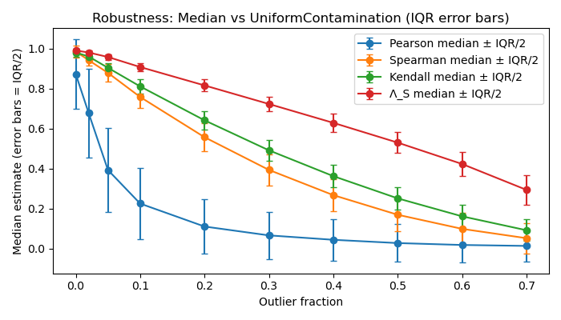
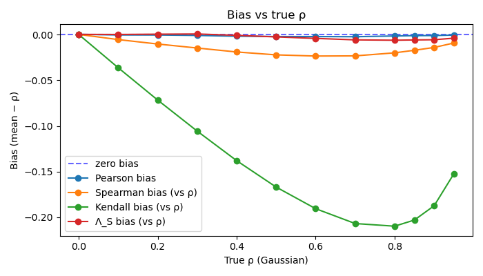
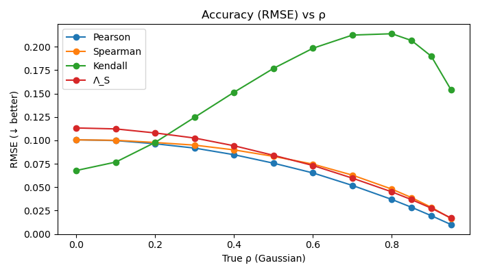
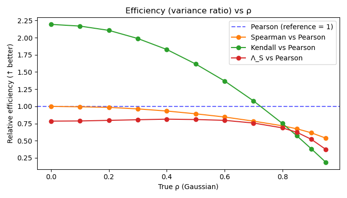
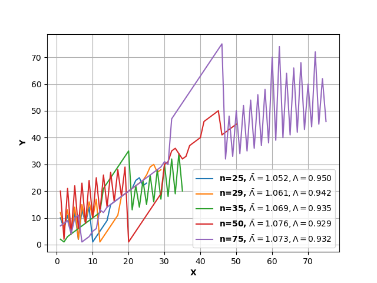
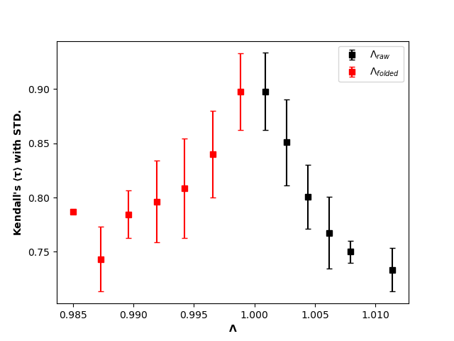

# lambda_corr — Repeated-Average Rank Correlation Λ (Lambda)

`lambda_corr` introduces and implements the **Repeated-Average Rank Correlation Λ (Lambda)**, a new family of **robust, symmetric, and asymmetric measures** of monotone association 
based on **pairwise rank slopes**. Compared with traditional rank-based measures (Spearman’s ρ and Kendall’s τ [1,2]), Lambda is:

- **Substantially more resistant to noise and outliers** (see [/results/\*Robustness\*.png](results/)).
<div align="center">

<table>
<tr>
<td align="center" style="vertical-align: middle;">

**Robustness of **$\mathbf{\Lambda_s}$**:  
Uniform distribution contamination of both variables  
                        (with limits 10*std(z))**  
$\rho_{true}$ = 1, n = 100  
Comparison vs Pearson's r, Spearman’s ρ and Kendall’s τ.

</td>
<td>

<p align="center">
  
</p>

</td>
</tr>
</table>

</div>


- **Much less biased relative to Pearson’s r [3] linear correlation** (see [/results/\*bias\*.png](results/)).
<div align="center">

<table>
<tr>
<td align="center" style="vertical-align: middle;">

**Bias of **$\mathbf{\Lambda_s}$** vs $\rho_{true}$**:  
n = 100  
Comparison vs Pearson's r, Spearman’s ρ and Kendall’s τ.

</td>
<td>

<p align="center">
  
</p>

</td>
</tr>
</table>

</div>

- **Competitive or superior in accuracy**, especially for moderate–strong signals (see [/results/\*accuracy\*.png](results/)).
<div align="center">

<table>
<tr>
<td align="center" style="vertical-align: middle;">

**Accuracy of **$\mathbf{\Lambda_s}$** vs $\rho_{true}$**:  
n = 100  
Comparison vs Pearson's r, Spearman’s ρ and Kendall’s τ.

</td>
<td>

<p align="center">
  
</p>

</td>
</tr>
</table>

</div>

- **Competitive in efficiency**, for moderate–strong signals. Slightly less efficient asymptotically (~81% vs. ~91% for ρ and τ) for the null. 
  See [/results/\*efficiency\*.png](results/) and [/results/\*power\*.png](results/)
<div align="center">

<table>
<tr>
<td align="center" style="vertical-align: middle;">

**Efficiency of **$\mathbf{\Lambda_s}$** vs $\rho_{true}$**:  
n = 100  
Comparison vs Pearson's r, Spearman’s ρ and Kendall’s τ.

</td>
<td>

<p align="center">
  
</p>

</td>
</tr>
</table>

</div>

<p align="center">
  <strong>(code for figures is in
    <a href="/tests/test_lambdacorr2.py">/tests/test_lambdacorr2.py</a>
  )</strong>
</p>

The canonical statistic, **$\mathbf{\Lambda_s}$**, combines a robust **median-of-pairwise-slopes inner loop** with an efficient **outer mean** (repeated-average, inspired by Seigel's repeated-median [4]), 
and uses a **signed geometric-mean symmetrization**, mirroring how:

- **Kendall’s $\mathbf{\tau_b}$** can be written as the signed geometric mean of **Somers’ D(y|x)** and **D(y|x)**;
- **Pearson’s r** is the signed geometric mean of the two OLS slopes
      $m_{Y\mid X} = \dfrac{\mathrm{cov}(x,y)}{\mathrm{var}(x)}$ and $m_{x\mid y} = \dfrac{\mathrm{cov}(x,y)}{\mathrm{var}(y)}$;
- **Spearman’s $\mathbf{\rho}$** has the same construction as Pearson's applied to the **rank-transformed**
  variables \($r_x$, $r_y$\).
  
**$\mathbf{\Lambda_s}$** extends this same geometric-mean construction to **robust repeated-average rank correlations**
and ensures interpretability as a standard measure of monotonic trend/association.

---

## Canonical Definition of $\mathbf{\Lambda_s}$

Given paired samples $(x_i, y_i)$, $i = 1,\dots,n$: symmetrize (via signed geometric mean) the asymmetric $\mathbf{\Lambda_{yx/xy}} = \underset{i}{\mathrm{mean}} \ \underset{j \neq i}{\mathrm{median}} \ \mathrm{slope}(i, j)$ in standardized rank space.

1. Compute **average ranks**:

Replace the raw $(x, y)$ values by their ranks, i.e. by the *positions* they occupy when the data are sorted, so that only relative ordering information is retained:

$$
r_x = \mathrm{rank}_{\mathrm{avg}}(x),
\qquad
r_y = \mathrm{rank}_{\mathrm{avg}}(y),
$$

where ties are assigned their average (mid) rank.

2. **Standardize ranks** to zero mean / unit variance:

$$
r_x^{\ast} = \frac{r_x - \overline{r_x}}{\sigma_{r_x}},
\qquad
r_y^{\ast} = \frac{r_y - \overline{r_y}}{\sigma_{r_y}} .
$$

Standardization doesn't affect $\mathbf{\Lambda_s}$ due to symmetrization but improves the stability of the asymmetric $\mathbf{\Lambda_{yx}/\Lambda_{xy}}$, especially when there are ties. Tests using 
Somers' D better agree on asymmetry when standardization is done, e.g., on binary data. Also, decreases the number of $\mathbf{\Lambda_{yx}/\Lambda_{xy}}$ sign disagreements for various scenarios (see [/tests/test_opposites.py](/tests/test_opposites.py)).
    
3. Compute **median slope in rank space** at each sample *i*:

$$
\begin{aligned}
b_i &=
\underset{j \ne i \land r_x^{\ast}(j) \ne r_x^{\ast}(i)}{\mathrm{median}}
\left(
\frac{ r_y^{\ast}(j) - r_y^{\ast}(i) }
     { r_x^{\ast}(j) - r_x^{\ast}(i) }
\right)
\end{aligned}
$$

4. Compute the **asymmetric** rank-slope correlations as the outer mean over i slopes:
- **Λ(y|x)**:

$$
\bar{\Lambda}_{yx} = \frac{1}{n} \sum_i b_i
$$

- **Λ(x|y)**: repeat with x and y swapped.

5. **Apply a fold-back transform** to the asymmetric components enforcing the range [-1, 1], and restoring the correct ordering relative to τ/ρ, for extremely rare, highly structured near-(anti)monotone rank configurations (see Fold-Back Transform section below):
 
$$
\begin{aligned}
\Lambda_{yx} &=
\mathrm{sign}\left(\bar{\Lambda}_{yx}\right)
\exp\left(
-\left|
\log\left|\bar{\Lambda}_{yx}\right|
\right|
\right)
\end{aligned}
$$
        
That is equivalent to:

$$
\begin{aligned}
\Lambda_{yx} &=
\mathrm{sign}\left(\bar{\Lambda}_{yx}\right)
\min\left(
\lvert \bar{\Lambda}_{yx} \rvert,
\lvert \bar{\Lambda}_{yx} \rvert^{-1}
\right)
\end{aligned}
$$

6. Define the **symmetric** $\mathbf{\Lambda_s}$ using the classical **signed geometric mean**:

$$
\Lambda_s = \mathrm{sgn}(\Lambda_{yx}) \sqrt{\left|\Lambda_{yx}\Lambda_{xy}\right|}
$$

If the asymmetric signs disagree, $\mathbf{\Lambda_s}$ = 0. Kendall's τ is on average approximately zero in these cases (see [/tests/test_opposites.py](/tests/test_opposites.py)).

---

## Fold-Back Transform

The mean-of-medians construction can very rarely produce $\lvert \bar\Lambda_{yx}\rvert$ or $\lvert \bar\Lambda_{xy}\rvert$ slightly larger than 1. These cases are extremely rare, highly structured near-(anti)monotone rank configurations where the set of pairwise rank slopes for one or more anchor points 
becomes strongly discrete and imbalanced (often exhibiting a localized oscillatory defect / weave-like structure). Such configurations are difficult to encounter by random permutations, but can be found more efficiently by stochastic swap/annealing searches that 
explicitly maximize $\lvert \bar\Lambda\rvert$. Empirically, observed overshoots are small ($\lvert \bar\Lambda_{\mathrm{asym}}\rvert \lesssim 1.08$ in search-constructed examples; values depend on $n$ and on the search procedure).

Within this overshoot regime, larger $\lvert \bar\Lambda\rvert$ corresponds to *weaker* monotone association when compared to Kendall’s $\tau$ and Spearman’s $\rho$ (i.e., among overshoot cases, $\bar\Lambda$ tends to anti-correlate with $\tau$ and $\rho$). To enforce the conventional correlation 
range $[-1,1]$ and restore the desired ordering in this regime, a reciprocal fold-back mapping is applied to the asymmetric components (prior to geometric-mean symmetrization): $f(\bar\Lambda_{\mathrm{asym}})=\mathrm{sign}(\bar\Lambda_{\mathrm{asym}})\cdot \exp(-\lvert \log(\lvert \bar\Lambda_{\mathrm{asym}}\rvert)\rvert)$, with $f(0)=0$, which is the identity on $[-1,1]$, preserves sign, and maps $\lvert \bar\Lambda_{\mathrm{asym}}\rvert>1$ back into $(0,1]$ via reciprocal inversion.
This transform is equivalent to: $\Lambda_{\mathrm{asym}} \leftarrow \bar\Lambda_{\mathrm{asym}}$ if $\lvert \bar\Lambda_{\mathrm{asym}}\rvert \le 1$ and $\Lambda_{\mathrm{asym}} \leftarrow 1/\bar\Lambda_{\mathrm{asym}}$ if $\lvert \bar\Lambda_{\mathrm{asym}}\rvert > 1$.

In the Monte Carlo calibration runs used for the null Beta-mixture fits (for p-values) and the bivariate-Gaussian benchmarks, fold-back was never activated (zero occurrences in billions of draws). Therefore, it had no effect on the calibrated null distribution or benchmark results.
    
Alternative stabilizations (e.g., Harrell–Davis quantile estimator per anchor, or Monte Carlo/permutation-based bias correction) can only reduce overshoot frequency and magnitude, but they materially change Λ and its null behavior; fold-back is used as a simple, deterministic guardrail.

**Examples of Overshoot Behavior**  
Shown are rank configurations that produce the largest observed *untransformed* value of the symmetric statistics for different sample sizes (found via stochastic annealing rank swap search). Listed in the legend are the $\bar{\Lambda}$ before transform and Λ after applying the reciprocal fold-back transform to the asymmetric components; the results are reasonable for this robust correlation measure.

<table>
<tr>
<td align="center" width="50%">
<b>(a) Possible maximal overshoot examples found via annealing search. Shown are the values of Λ_s before and after fold-back.</b><br>

</td>

<td align="center" width="50%">
<b>(b) Λ_s statistic before and after fold-back transform compared to Kendall's τ (found by random indice swapping from perfect association). The proper ordering of association strength is recovered.</b><br>

</td>
</tr>
</table>

---

## Properties of $\Lambda_s$

- **Range:** $\mathbf{\Lambda_s}$ **∈** \([-1,1]\).
- **Symmetric:** $\mathbf{\Lambda_s}(x,y)$ **==** $\mathbf{\Lambda_s}(y,x)$.
- **Invariant under strictly monotone transforms:** $\mathbf{\Lambda_s}(x,y)$ is unchanged under $x \mapsto f(x)$ or $y \mapsto g(y)$ for any strictly monotone functions $f, g$.
- **Robust: Very robust to outliers and noise**; extremely high sign-breakdown 
                  point (median-of-slopes core) with adversarial contamination
                  (see [/results/\*Robustness\*.png](/results)).
- **Less biased: Much less biased than Spearman or Kendall relative to Pearson**
                  (see [/results/\*bias\*.png](/results)).
- **Accurate: Competitive or superior in accuracy** for moderate–strong signals.
- **Efficiency:** Asymptotic efficiency ~81% (ρ, τ ≈ 91%) with **var_opt/var(**$\mathbf{\Lambda_s}$**) = (1/N)/(1.112^2/N)**.
                  (Siegel median of medians slope is ~41%). 
                  See [/results/\*efficiency\*.png](/results) and [/results/\*power\*.png](/results)
- **Null distribution:** centered, symmetric, slightly heavier tails than Spearman. Beta-mixture null 
                  model for |Λ_s| with point masses at 0 and ±1 (Beta on (0,1) and a mirrored Beta on (-1, 0)).

---

## Notes on the Non-Canonical Repeated-Average Correlations
- A fully **repeated-median Λ** has maximal robustness but reduced asymptotic efficiency, while the **mean-of-medians** $\mathbf{\Lambda_s}$ recovers much of the efficiency at minimal loss of breakdown.
- A **mean-of-means Λ** is Theil-Sen in rank-space and is essentially Spearman in both efficiency and null spread, but gives up most of the robustness advantage compared to the mean of medians.
- Continuum of **Λ** variants' behavior (outside loop - inside loop):

  Spearman (ρ) ≈ $\mathbf{\Lambda_s}^{(mean-mean)}$  <->  $[\mathbf{\Lambda_s}^{(mean-median)}]$  <-> $\mathbf{\Lambda_s}^{(median-mean)}$  <->  $\mathbf{\Lambda_s}^{(median-median)}$ ≈ Siegel's slope
  
  **Canonical choice:** $\mathbf{\Lambda_s}^{(mean-median)}$ — best efficiency/robustness balance (especially at low statistics).

---

## p-values
`lambda_corr` supports three p-value modes. In all cases, if `ties=False` and `n ≤ 10`, an **exact lookup table** is used for the symmetric statistic $\mathbf{\Lambda_s}$ regardless of `ptype`.  
P-values for the asymmetric components ($\mathbf{\Lambda_{xy}}$, $\mathbf{\Lambda_{yx}}$) are returned **only** when a permutation test is used; otherwise **NaN** is returned for asymmetric p-values.
 
### `ptype="default"` (recommended)
- Changes behavior based on **ties** keyword.
- **ties=True** → Monte Carlo **permutation test**. P-values for $\mathbf{\Lambda_s}$, $\mathbf{\Lambda_{xy}}$, $\mathbf{\Lambda_{yx}}$ are returned.
- **n ≤ 10** → **Exact p-value** for $\mathbf{\Lambda_s}$ if `ties=False` (default); otherwise Monte Carlo **permutation test**.
- **n > 10** and `ties=False` → **Beta-mixture null model approximation** for **Λ_s**. Asymmetric p-values are **NaN**.

### `ptype="perm"`
- Uses a Monte Carlo **permutation test** (all `n`).
  Special case: if `ties=False` and `n ≤ 10`, $\mathbf{\Lambda_s}$ uses the **exact lookup table**.
- Returns p-values for $\mathbf{\Lambda_s}$, $\mathbf{\Lambda_{xy}}$, $\mathbf{\Lambda_{yx}}$.
- Valid with **ties or arbitrary marginals** (conditional null; see below).
- Early stopping when p-uncertainty < `p_tol`.
- This calculation is **stochastic**, so permutation p-values vary across runs. Re-running can help the user gauge Monte Carlo uncertainty, if desired.

### `ptype="approx"`
- **n ≤ 10** → **Exact lookup table** for $\mathbf{\Lambda_s}$. This is only an exact p-value if there are no ties.
- **n > 10** → **Fast** approximate p-values for $\mathbf{\Lambda_s}$.
- Directional components **Λ_xy** and **Λ_yx** are returned as NaN as they require permutation for valid p-values.
- Assumes no ties; accuracy degrades as tie frequency increases.
- Approximate p-value from an **n-dependent Beta-mixture unconditional null** for |$\mathbf{\Lambda_s}$| with point masses at 0 and ±1 and a Beta fit on (0,1). Model parameters *(p0(n), p1(n), α(n), β(n))* are calibrated from extremely large Monte Carlo null simulations (`n`>11) at increasing sample sizes, parametrically interpolated (`n`>30) for intermediate values, and extrapolated for large samples (`n`>1000). 

The permutation test samples from the *conditional* null distribution, generated by permuting the observed `y` values while keeping `x` fixed. This distribution depends directly on the observed marginals and tie structure. Therefore, when the *underlying population is genuinely discrete*, the permutation method can be more accurate because it automatically reflects the correct amount and pattern of ties.

In contrast, the approximate p-values target an *unconditional* null distribution for **Λ_s**, calibrated from extremely large Monte Carlo simulations under continuous no-tie assumptions. As a result, they tend to be more stable (and often more accurate) for moderate–large `n`, especially when the *underlying population is continuous* (even if the sample exhibits ties due to rounding, censoring, or finite precision).

Repeated points for emphasis:
- `p_xy` and `p_yx` are returned only when a permutation test is run; otherwise they are NaN.
- In `ptype="perm"` with `ties=False` and `n ≤ 10`, the code still runs permutations, but `p_s` is replaced by the exact lookup value.
- `ptype="approx"` assumes no ties; if ties are present, results may be biased (especially for small `n`).

### Summary Table (p-values)

| Condition              | `ptype="default"`                 | `ptype="approx"`                       | `ptype="perm"`                      |
|---|---|---|---|
| `ties=True`, `n ≤ 10`  | permutation (p_s, p_yx, p_xy)     | table p_s (not exact); p_yx/p_xy = NaN | permutation (p_s, p_yx, p_xy)       |
| `ties=True`, `n > 10`  | permutation (p_s, p_yx, p_xy)     | Beta-mixture p_s; p_yx/p_xy = NaN      | permutation (p_s, p_yx, p_xy)       |
| `ties=False`, `n ≤ 10` | exact p_s; p_yx/p_xy = NaN        | exact p_s; p_yx/p_xy= NaN              | exact p_s; permutation (p_yx, p_xy) |
| `ties=False`, `n > 10` | Beta-mixture p_s; p_yx/p_xy = NaN | Beta-mixture p_s; p_yx/p_xy = NaN      | permutation (p_s, p_yx, p_xy)       |

---

## Returned Values
```
Lambda_s, p_s, Lambda_yx, p_yx, Lambda_xy, p_xy, Lambda_a
```
Where:

- **$\mathbf{\Lambda_s}$** — symmetric correlation.
- **Λ(y|x)** / **Λ(x|y)** — asymmetric directional correlations.
- **p-values** correspond to the chosen `alt = {"two-sided","greater","less"}`.
- **$\mathbf{\Lambda_a}$** — normalized asymmetry index with range [0, 1].

$$
\Lambda_a = \frac{\bigl|\Lambda_{yx} - \Lambda_{xy}\bigr|}
                 {\bigl|\Lambda_{yx}\bigr| + \bigl|\Lambda_{xy}\bigr|}
$$

with $\mathbf{\Lambda_a}$ $\in [0,1]$.

---
    
## Installation
The library targets Python 3.8+ and uses NumPy and Numba for speed.

```bash

#Install lambda-corr from pypi with pip
pip install lambda-corr

#Or local install from source
pip install -e .

#Install optional test dependencies (SciPy)
pip install -e .[tests]

#Prerequisites if necessary
pip install numba numpy

#Optional: statistical tests make use of SciPy
pip install scipy

#Optional: for Numba fast math optimizations on Intel CPUs
pip install icc_rt

```

Requirements:
- Python ≥ 3.8  
- NumPy ≥ 1.23
- Numba ≥ 0.61
- SciPy ≥ 1.9 (only needed for some validation tests)

---

## Quick Example
Compute the symmetric Lambda correlation **$\mathbf{\Lambda_s}$** and its directional components for a simple monotonic relationship:
```python

import numpy as np
import math
from lambda_corr import lambda_corr

rng = np.random.default_rng(seed=0)

n = 50
rho = 0.5   # correlation strength
x = rng.standard_normal(n)
z = rng.standard_normal(n)
c = math.sqrt((1 - rho) * (1 + rho))
y = np.exp(rho * x + c * z)   # any monotonic transformation

# Compute Lambda correlations
Lambda_s, p_s, Lambda_yx, p_yx, Lambda_xy, p_xy, Lambda_a = lambda_corr(x, y)
#or 
#Lambda_s, p_s, Lambda_yx, p_yx, Lambda_xy, p_xy, Lambda_a = lambda_corr_nb(x, y, y.size) 
#for inside Numba @njit functions

# Nicely formatted output
print(f"Λ_s       = {Lambda_s: .4f}   (p = {p_s: .4g})")
print(f"Λ(y|x)    = {Lambda_yx: .4f}   (p = {p_yx: .4g})")
print(f"Λ(x|y)    = {Lambda_xy: .4f}   (p = {p_xy: .4g})")
print(f"Asymmetry = {Lambda_a: .4f}")

# Example output:
# Λ_s       =  0.4130   (p =  0.0087)     #Result will be close to rho
# Λ(y|x)    =  0.4145   (p =  0.008419)
# Λ(x|y)    =  0.4114   (p =  0.008988)
# Asymmetry =  0.0038

```

## Extended Example
Code in [`example/`](./example/) shows how to apply my Telescope Array analysis,
“Evidence for a Supergalactic Structure of Magnetic Deflection Multiplets of Ultra-high-energy Cosmic Rays”
([arXiv:2005.07312v2](https://arxiv.org/abs/2005.07312v2)) to [Pierre Auger Observatory public data](https://opendata.auger.org/) using the $\mathbf{\Lambda_s}$ correlation.

---

## References
[1] Spearman, C. The proof and measurement of association between two things. 
      American Journal of Psychology, 15(1), 72–101, 1904.
      
[2] Kendall, M.G., Rank Correlation Methods (4th Edition), Charles 
      Griffin & Co., 1970.
      
[3] https://en.wikipedia.org/wiki/Pearson_correlation_coefficient

[4]Siegel, A.F., Robust Regression Using Repeated Medians, Biometrika, 
      Vol. 69, pp. 242-244, 1982.

---

## Citation
If you use lambda_corr in academic or scientific work, please cite:
```bash
Lundquist, J.P.  lambda_corr: Robust Repeated-Average Rank Correlation Λ (Lambda).
GitHub repository: https://github.com/JonPaulLundquist/lambda_corr
```

```bash
@misc{lundquist2025lambda_corr,
  author       = {Lundquist, Jon Paul},
  title        = {lambda\_corr: Robust Repeated-Average Rank Correlation (Λ)},
  year         = {2025},
  publisher    = {GitHub},
  howpublished = {\url{https://github.com/JonPaulLundquist/lambda_corr}},
  note         = {Version X.Y.Z. Accessed: YYYY-MM-DD}
}
```
